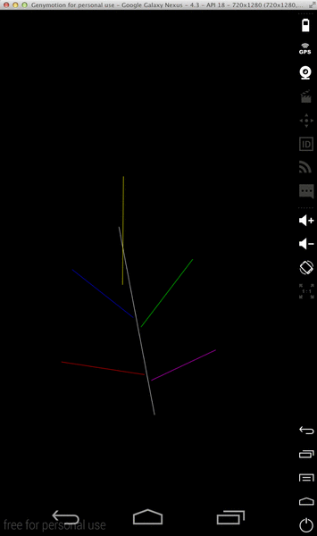

# Android Fractal Application

### Installation

From the command line issue the following commands:

1. `cd [WORKING DIRECTORY]` : to move into the working directory
2. `git clone --recursive [CLONE REPOSITORY URL]` : to clone the project's repository
3. `cd fractal-android/` : to move into the sub-directory of the project just cloned
4. `./gradlew assemble` : to build the **APK** file to upload to your android device

Upload the **APK** file assembled to your android device.
Location: `[WORKING DIRECTORY]/fractal-android/app/build/outputs/apk/app-free-release-unsigned.apk`

Install this **APK** file on your android device.

Launch the android fractal application just installed.

### Usage

The idea of the application is to define a set of lines that will form a geometric pattern for the application to
eventually apply self-similarity to the rest of them in order to generate the fractal.

1. Draw these pattern `lines` on your screen (patterns) through dragging gestures.
2. Optionally for each line the color may be preset through the `Change Color...` menu option.
3. Once ready to see the fractal corresponding to the pattern drawn select the `Generate New Fractal` menu option.
4. Finally answer to the popup menu `How many recursions` you want to compute on the fractal and see the fractal drawn on the screen.

*As a warning, it is better not to define too many lines in the pattern (5 should be fine), nor higher recursion levels
(no more than 7 for a 5 line pattern); as the recursion is memory and processing intensive and the application is prone
to crash if the fractal is too big.*

### Implementation

- This client application links the [Fractal Library](https://github.com/marco-ruiz/fractal-framework) as a subproject,
to provide the computational aspects of generating the fractal.
- For that reason the cloning of this project must include the `--recursive` option.
